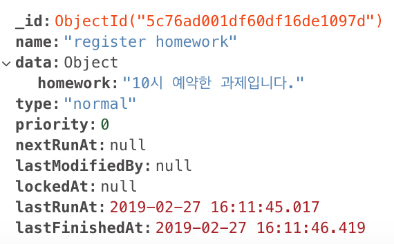

# 슬랙 예약 관리 서버

[Slack SDK](https://github.com/slackapi/node-slack-sdk)와 Node 스케쥴러 [Agenda](https://github.com/agenda/agenda)를 [Koa](https://koajs.com)서버에 구축하여 특정시간에 슬랙 메세지를 실행시키는 서버

## 스택
[Incoming Webhooks API](https://slack.dev/node-slack-sdk/incoming_webhook): 슬랙 메세지를 등록할 수 있는 http 메소드를 구현해놓은 API로, 메세지를 보내기만 하는 용도이기 때문에 간단한 셋팅만으로 구현가능하다는 장점이 있다. 

[Agenda](https://github.com/agenda/agenda): 경량화된 Node 스케쥴러로, 등록한 job들을 MongoDB에 저장하여 스케쥴 유실을 막아주고 있다. 

node-cron을 사용하지 않고 Agenda를 사용한 이유는 

1. Human-interval을 사용하여 가독성을 높힘 (http://date.js.org/ 참조)
2. 주기적으로 실행하는 것이 아닌 일회성으로 사용해야 되기 때문에 실행후 job을 제거해야하는 번거로움을 줄임

